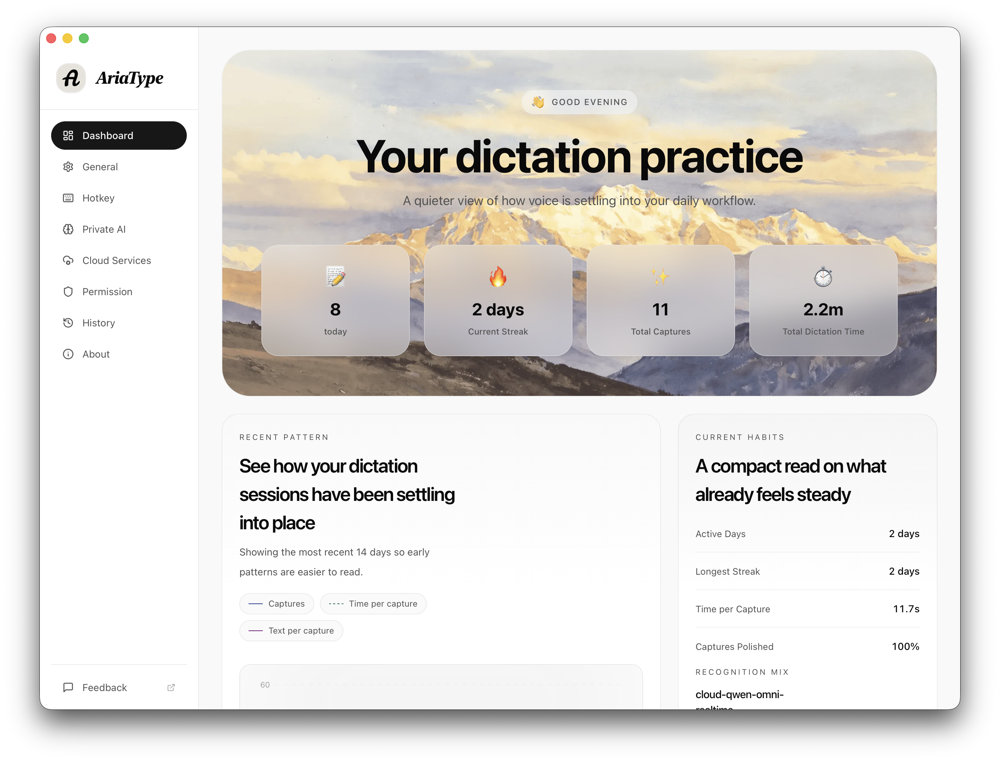

<div align="center">


<br/><br/>

### AriaType

macOS 向けの音声入力ツールです。ホットキーを押しながら話して、離すと文字が今のアプリに入ります。

[English](README.md) | [简体中文](README-cn.md) | 日本語 | [한국어](README-ko.md) | [Español](README-es.md)

[](LICENSE)
[-pink)](https://github.com/SparklingSynapse/AriaType/releases)
[](https://github.com/SparklingSynapse/AriaType/releases)

[ダウンロード](https://github.com/SparklingSynapse/AriaType/releases) • [ドキュメント](docs/README.md) • [ディスカッション](https://github.com/SparklingSynapse/AriaType/discussions) • [Webサイト](https://ariatype.com)

</div>

---

## これは何か

AriaType はデスクトップ向けの音声入力アプリです。

バックグラウンドで常駐し、入力したいときだけ使えます。ショートカットキーを押しながら自然に話し、離すと音声が文字になって、VS Code、Slack、Notion、ブラウザなど今使っているアプリにそのまま入ります。

## 使う理由

- ローカル優先: 音声認識もテキスト整形も標準では手元のマシンで動きます。
- プライベート: 音声データを外に送る前提ではありません。
- シンプル: `Shift+Space` を押す、話す、離すだけです。
- 実用的: アプリをまたいで使えて、100 以上の言語に対応します。
- 調整できる: 速度と精度のバランス、ホットキー、書き換え動作を変えられます。

## クイックスタート

### インストール

- macOS（Apple Silicon）: 最新の [.dmg](https://github.com/SparklingSynapse/AriaType/releases) をダウンロードし、Applications に入れて起動します。
- Windows: 現在対応中です。

### 初回起動

1. マイクとアクセシビリティの権限を許可します。
2. 音声モデルをダウンロードします。まずは `Base` がおすすめです。
3. 言語を選ぶか、自動検出を使います。
4. エディタを開いて試します。

## 使い方

1. ホットキーを押します。デフォルトは `Shift+Space` です。
2. 話します。
3. 離すと文字が入力されます。

必要なら、口ぐせ、句読点、文法も整えてから入力できます。

## 動作環境

- macOS 12 以降
- Apple Silicon Mac
- メモリ 8 GB 以上、推奨 16 GB
- モデル用に 2-5 GB の空き容量

## 開発者向け

このリポジトリは monorepo です。

- `apps/desktop`: Tauri デスクトップアプリ
- `packages/website`: 公式サイト
- `packages/shared`: 共通の TypeScript 型と定数

### セットアップ

```bash
pnpm install
pnpm tauri:dev
pnpm --filter @ariatype/website dev
```

### 最初に見る場所

- [`AGENTS.md`](AGENTS.md): ワークフロー、検証コマンド、リポジトリのルール
- [`docs/README.md`](docs/README.md): ドキュメントの入口
- [`apps/desktop/CONTRIBUTING.md`](apps/desktop/CONTRIBUTING.md): デスクトップアプリ開発ガイド
- [`packages/website/CONTRIBUTING.md`](packages/website/CONTRIBUTING.md): Web サイト開発ガイド

## コミュニティ

- バグ報告と要望: [GitHub Issues](https://github.com/SparklingSynapse/AriaType/issues)
- 質問と議論: [GitHub Discussions](https://github.com/SparklingSynapse/AriaType/discussions)

## ライセンス

AriaType は [AGPL-3.0](LICENSE) で公開しています。
